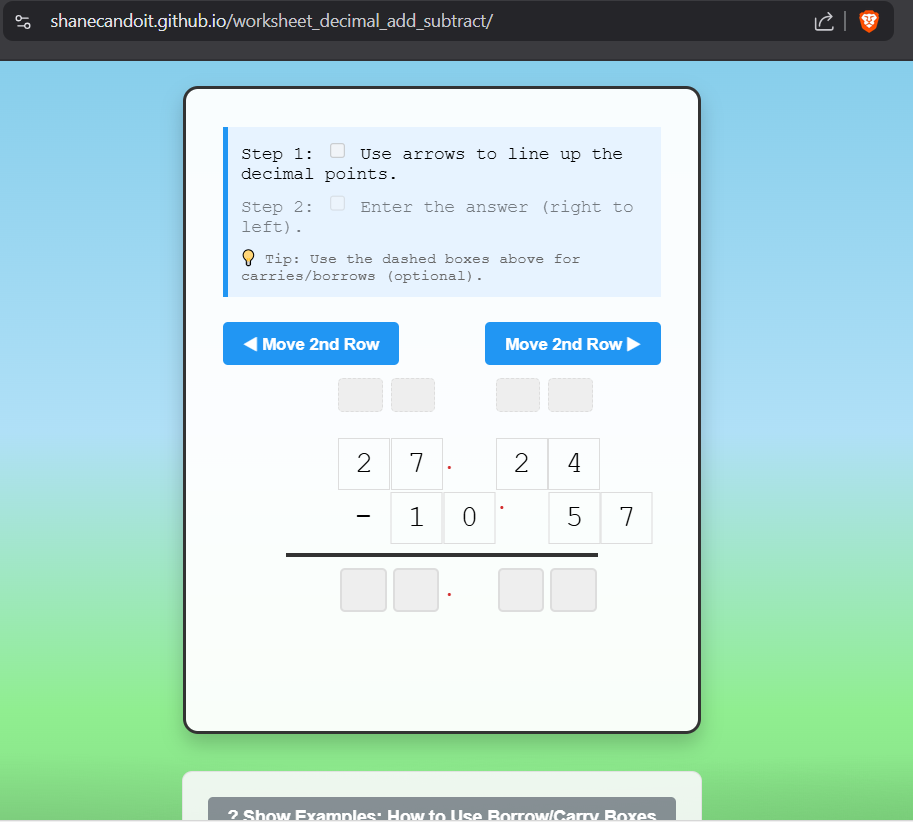

# Decimal Addition & Subtraction Worksheet

An interactive math practice tool for learning decimal addition and subtraction with visual alignment and optional carry/borrow annotations.

## Features

### 🎯 **Three-Step Learning Process**

1. **Alignment** - Use arrow buttons to shift the second row until decimal points line up
2. **Calculation** - Enter the answer from right to left (hundredths → tens)
3. **Optional Scratch Work** - Use dashed boxes above for carries/borrows (not required!)

### ✨ **Interactive Elements**

- **Visual Feedback** - Green for correct, red for incorrect, instant validation
- **Strikethrough Notation** - Original digits cross out when you write borrow/carry values above
- **Confetti Animation** - Celebrate correct answers with colorful confetti 🎉
- **Slide Transitions** - Problems slide up/down when you click "Next Problem"

### 🏆 **Mastery System**

- **Coin Progress** - Visual coin indicator fills by thirds with each correct answer
- **Streak Tracking** - Get 3 problems correct in a row to earn a complete coin
- **Motivation** - Total coins earned displayed above examples section
- **No Penalties** - Wrong answers don't reset your streak, encouraging experimentation

### 🌳 **Cozy Design**

- Relaxing blue sky and green hills background
- Semi-transparent worksheet cards
- Smooth animations and friendly UI

### 📚 **Built-in Examples**

Click "Show Examples" to see step-by-step walkthroughs of:

- Subtraction with borrowing (including borrowing through zeros)
- Addition with carries
- Quick reference rules

## How It Works

The app generates random addition and subtraction problems with decimals. Students must:

1. Align the decimal points by shifting the second row
2. Optionally use annotation boxes for mental math scaffolding
3. Enter the final answer digit by digit

The scratch boxes validate against expected carry/borrow values but **don't block** the answer inputs - they're purely optional learning aids.

## Usage

Simply open `index.html` in a web browser. No dependencies or build process required!

## Educational Philosophy

This tool follows a "cognitive rebuilding" approach:

- Encourages right-to-left calculation (matching standard algorithms)
- Provides immediate feedback without punishment
- Makes carries/borrows optional to support different learning styles
- Focuses on decimal point alignment as a foundational skill

Perfect for elementary students learning decimal arithmetic or anyone brushing up on basic math skills.
